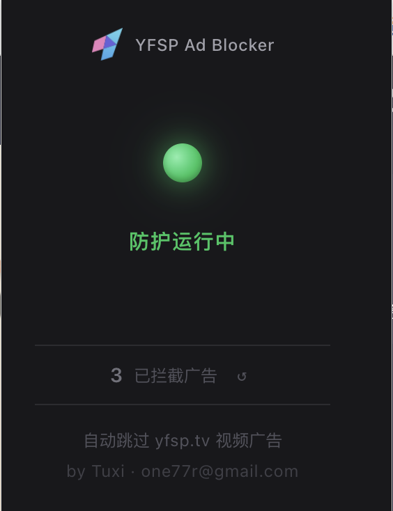
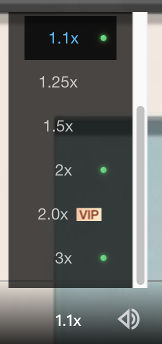

# YFSP Ad Blocker

自动跳过 [yfsp.tv](https://www.yfsp.tv/) 视频广告的 Chrome 扩展。

<p>
  
  
</p>

## tl;dr

如果你不懂技术，请参考[这篇文章](https://github.com/cherishh/yfsp-blocker/blob/main/how-to-use.md)进行安装。

## 功能

- 自动移除广告遮罩层
- 广告移除后自动恢复播放
- 统计已拦截广告数量
- 更多倍速调节，包括VIP倍速

## 工作原理

1. **MutationObserver** 监听 DOM 变化，检测广告遮罩元素
2. 检测到广告后立即移除遮罩层
3. 自动点击播放按钮恢复播放
4. 强制显示播放器控制栏 25 秒，方便用户操作

## 安装

### 从源码安装

1. 克隆仓库：
   ```bash
   git clone https://github.com/yourusername/yfsp-blocker.git
   cd yfsp-blocker
   ```

2. 安装依赖：
   ```bash
   pnpm install
   ```

3. 构建扩展：
   ```bash
   pnpm build
   ```

4. 加载到 Chrome：
   - 打开 `chrome://extensions`
   - 开启「开发者模式」
   - 点击「加载已解压的扩展程序」
   - 选择 `.output/chrome-mv3` 目录

## 开发

```bash
# 启动开发服务器（支持 HMR）
pnpm dev

# 生产构建
pnpm build

# Firefox 构建
pnpm build:firefox

# 类型检查
pnpm compile
```

## 技术栈

- [WXT](https://wxt.dev/) - 新一代浏览器扩展框架
- [React](https://react.dev/) - Popup UI
- [TypeScript](https://www.typescriptlang.org/) - 类型安全
- Manifest V3

## 项目结构

```
yfsp-blocker/
├── entrypoints/
│   ├── content.ts        # 核心广告拦截逻辑
│   ├── background.ts     # Service Worker
│   └── popup/            # React Popup UI
│       ├── App.tsx
│       ├── App.css
│       └── main.tsx
├── public/
│   ├── icon/             # 扩展图标
├── wxt.config.ts         # WXT 配置
└── package.json
```

## 许可证

MIT
